# A - Connector derived index

A returned accurate cited answers for the administrator and an authorized ordinary Reader while their original-source API calls returned 403.

Synthetic demo: 7–8 October 2026; results through the 08:24 KST checkpoint on 8 October.

| Test | Result | Boundary |
|---|---|---|
| Administrator Copilot | **PASS:** three requested cleaning/seasoning facts, clicked A citation | Hard-scoped agent; earlier wrong-source and no-result attempts retained below |
| Ordinary Reader Copilot | **PASS:** same facts and verified A citation | Native Copilot with mixed sources; no personal A-agent installation |
| Original-source access | **403** for admin, Reader and Outsider metadata/list calls | Browser denial was verified for admin only |
| Outsider retrieval | A-scoped Search returned zero hits; joint A/C Copilot prompt returned no facts or citations | Separate scoped API negative; **one** joint UI scenario, not two |
| Publication and lifecycle | Six approved items matched readback; withdrawal returned 404 and re-publication restored them | Search disappearance, guest access, revocation and actual expiry removal **NOT RUN** |

> Sanitized historical evidence: identifiers are placeholders, not operational configuration. Screenshots retain redaction labels; sanitized artifacts cannot verify original hashes. Results apply only to the named identities and operations, not production controls. Approvals and deadlines describe their recorded checkpoint.

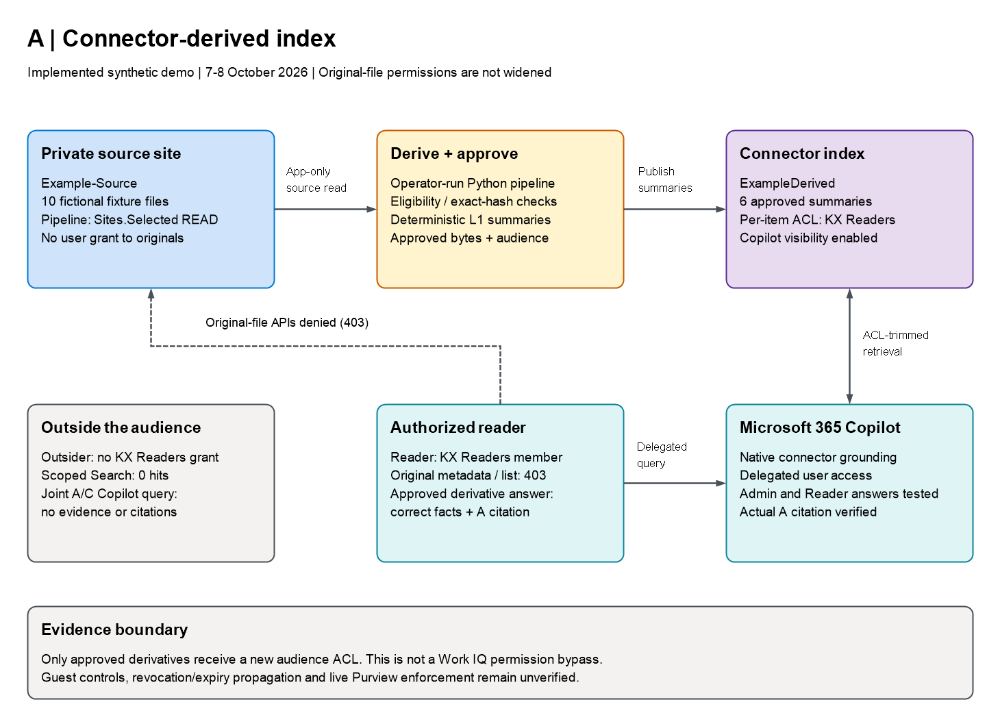

*Sanitized diagram of the implemented demo, not the production target.*
[Architecture and source files](../../../docs/01_Technical_Architecture.md#architecture-a).

## Visual evidence

### Authorized ordinary reader

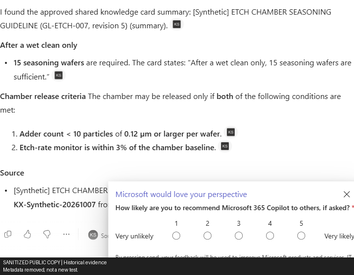

*Sanitized capture — Reader: a Microsoft survey overlay covers the lower citation area; the main facts remain visible.
The clicked A citation was verified separately in the recorded test. The C-intended prompt used mixed sources;
this is an A grounding pass, not a C pass or a personal A-agent test.*

### Admin hard-scoped answer and citation

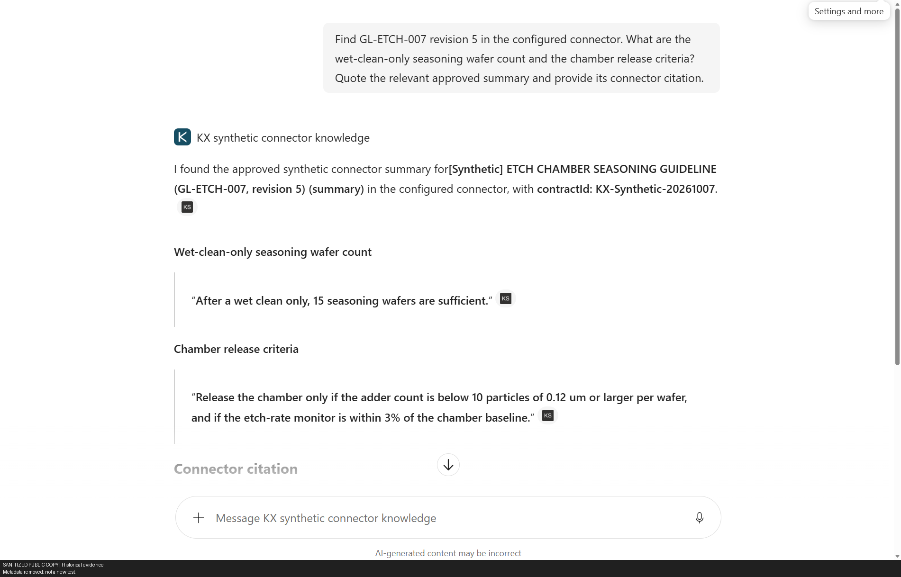

*Sanitized capture — Administrator: later hard-scoped A query returned all three requested facts; earlier no-result attempt remains a failure.*

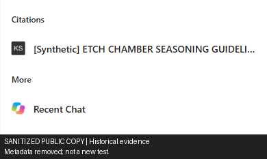

*Sanitized capture — Administrator: native citation opened the approved A opaque URL, not the C SharePoint card.*

### User outside the approved audience

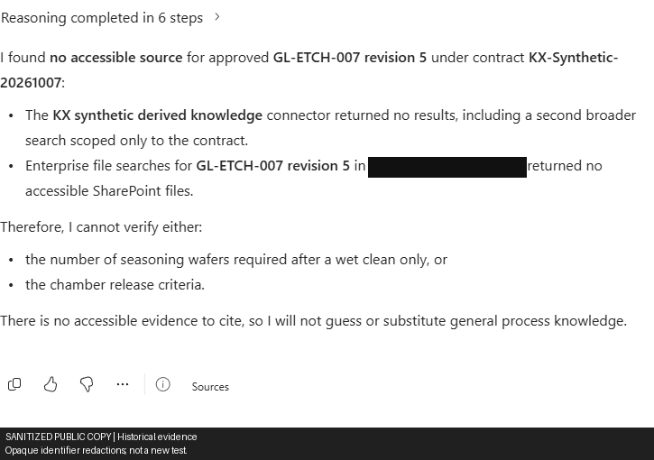

*Sanitized capture — Outsider: one joint A/C prompt returned no requested facts or citations.*

Diagnostic history — six earlier attempts and control screenshots

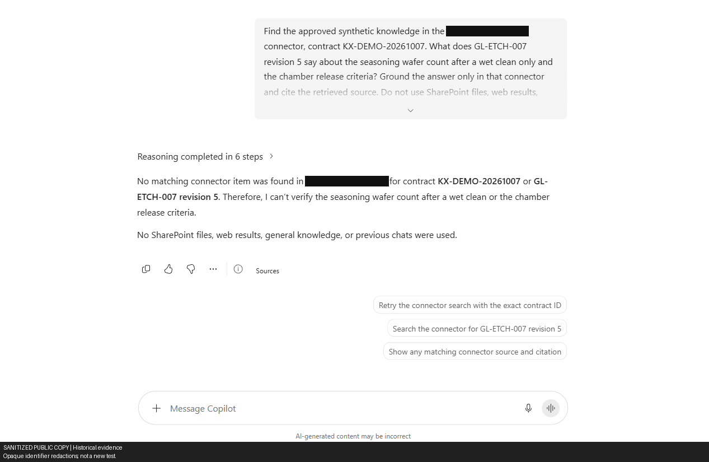

*Sanitized capture — Administrator: no result with B's contract name; not a valid test of properly scoped A retrieval.*

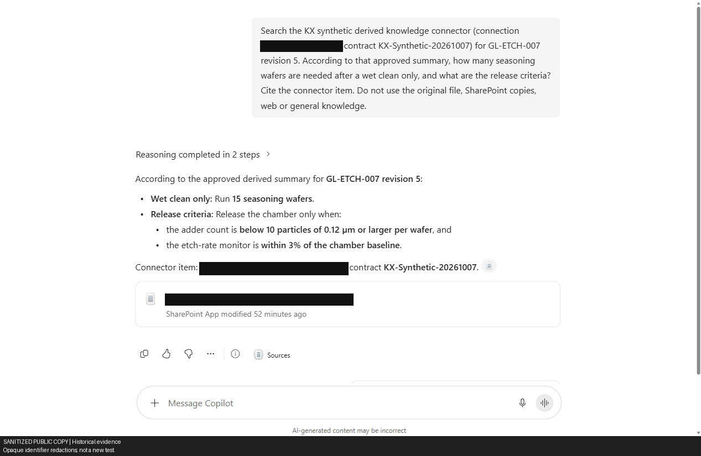

*Sanitized capture — Administrator: facts were correct but the citation was C SharePoint. Failed A source isolation.*

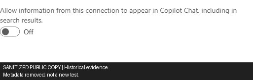

*Sanitized capture — Administrator: Copilot Visibility was OFF with an exclusion warning; a control observation, not a grounding test.*

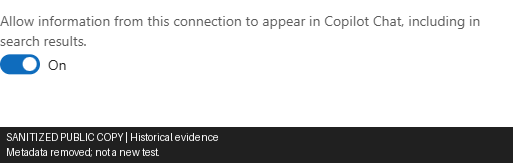

*Sanitized capture — Administrator: full reload retained ON with no warning; grounding was tested separately.*

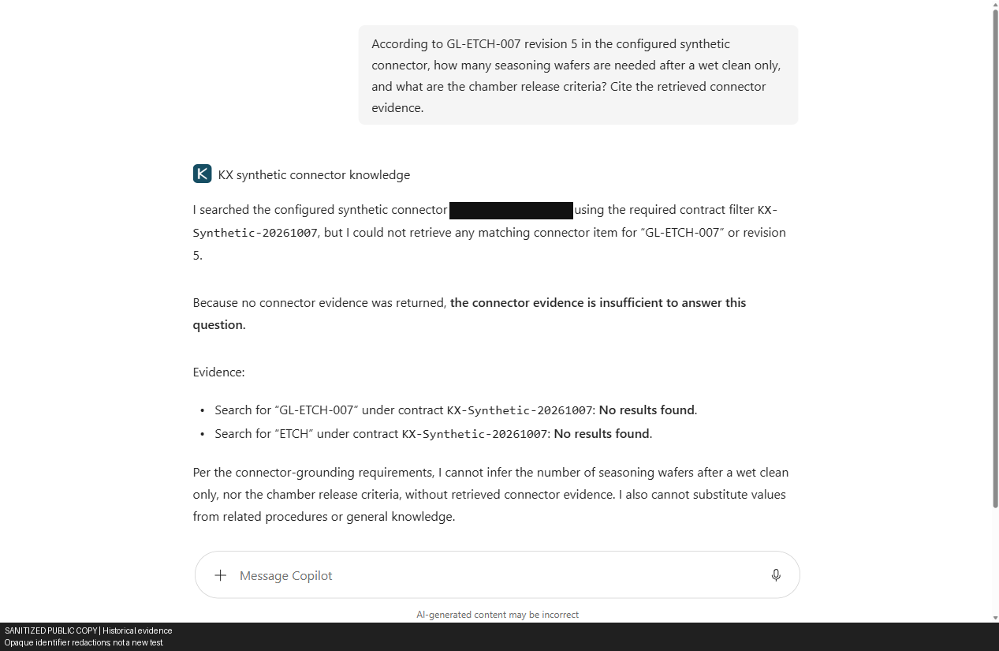

*Sanitized capture — Administrator: first hard-scoped query returned no evidence or citation.*

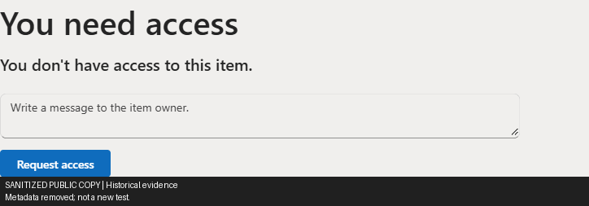

*Sanitized capture — Administrator, not Reader: direct original-file access was denied. Reader's original-source negative is API-only;
the separate SharePoint session remained admin.*

Diagnostic history — API checks, retrieval failures, enablement and later retries

## Detailed test record

**16:15–16:16 KST update:** Copilot Visibility changed from **OFF to checked ON**, and the prior warning disappeared.
The observed enablement POST returned **204**. An early connection-detail read listed only Microsoft Search in
`enabledContentExperiencesV2`; this is historical, not proof that Copilot is currently disabled.
**Full portal reload at ~16:43 KST retained checked ON and no exclusion warning**:
[screenshot](../screenshots/a-copilot-visibility-after-reload.png). Actual grounding is a separate test. All six item ACLs still
grant only the Readers group, with original expiry unchanged. Earlier query-scope/cross-source failures remain separate evidence.
**Post-enable exact readback at 07:58:34 UTC:** all six items match approved **content, ACL and properties**,
allowing only the five previously identified Graph service fields. This completes the content-byte/property check,
not just ACL inspection. [Recorded comparison](../evidence/connector-post-enable-readback.json).

| Test | Actual result | Status |
|---|---|---|
| Application scope | Pipeline has `Sites.Selected`: source read, Exchange write; connector permissions limited to owned connections. | PASS |
| Source read | Real Graph source metadata and content downloaded with the pipeline certificate identity. | PASS |
| Source write denial | PUT of a synthetic canary returned HTTP 403. Request `f0000000-0000-4000-8000-000000000027`. | PASS |
| Ungranted site denial | Root-site drive access returned HTTP 403. Request `f0000000-0000-4000-8000-000000000004`. | PASS |
| Connection/schema | `ExampleDerived`, state `ready`, 10 properties. Registration took 133 seconds. | PASS |
| Initial source ingestion | Full `root/delta` enumeration. Six eligible files; four excluded: opt-out log, above-ceiling fixture, internal path, draft path. | PASS |
| Source integrity | Downloaded bytes must match the registered fixture SHA-256; eTag checked before/after download. | PASS |
| Label metadata | Unlabelled TXT returned empty label ID/name and `protectionEnabled:false`; label extraction returned HTTP 415. | OBSERVED |
| Derived-item publication | Six approved JSON payloads published. ACL, content and approved properties matched readback. | PASS |
| Known-pattern payload scan | Exact twelve A/C outputs passed seeded PII/secret/Highly Confidential canaries and original-host checks. No unseen-content or Copilot-answer evaluation. | PASS, PAYLOAD ONLY |
| Withdrawal | One source's item deleted; subsequent GET returned 404. Repeating withdrawal deleted nothing. | PASS |
| Re-publication | Previously approved bytes re-published under the user's lifecycle-test authorization. Six items restored. | PASS |
| Independent delegated reader/outsider | Outsider: original metadata/list 403, A Search 200/zero. Reader: original metadata/list 403; A Search 200/zero at 17:51, 200/one hit at ~21:00. Cause of the earlier miss unknown. | NAMED API CASES PASS; EARLIER READER FAILURE RETAINED |
| Copilot availability/licensing | A/B personally installed for admin only; no tenant catalogue. Reader used native Copilot without a personal A installation. Earlier newly created synthetic accounts remain unlicensed. | ADMIN AND Reader UI VERIFIED |
| Native ordinary-reader grounding | Verified Reader account: correct 15 / <10 particles ≥0.12 µm / within 3%; native citation metadata and actual click to approved A `ref-000000000000000000000005`. Mixed C-intended prompt, not the admin's hard-scoped agent. | PASS, Reader A ANSWER/PROVENANCE |
| Native outsider A/C prompt | Verified Outsider account, both Microsoft 365 and KX enabled: no accessible evidence, requested facts or citations. One joint scenario, not separate internal retrieval traces. | PASS, OBSERVED OUTSIDER NEGATIVE |
| Corrected-contract Copilot attempt | Prompt used `KX-Synthetic-20261007`; facts were correct, but the sole citation was a C SharePoint viewer, despite the answer calling it a connector item. | FAILED A SOURCE ISOLATION |
| Copilot Visibility control | Actual API-created `ExampleDerived` admin page exposed the control, initially OFF, with a no-Copilot/Search warning. | OBSERVED MISSING ENABLEMENT |
| Enablement UI/API response | ON checked and warning gone after ~16:15 KST activation; observed POST `/fd/mssearchconnectors/v1.0/admin/connections/ExampleDerived/migrateFCC` returned 204. | PASS, UI/REQUEST ONLY |
| Post-enable verification | Full reload ~16:43 retained ON/no warning. At **07:58:34 UTC**, all six approved content/ACL/property comparisons passed, allowing only known five service fields; expiry unchanged. Earlier Search-only backend field remains historical. | PASS, RELOADED UI/EXACT READBACK |
| Later grounding retry | ~16:46–16:48 KST: **15 wafers**, **<10 particles ≥0.12 µm per wafer**, **etch rate within 3%**; actual native citation opened approved A opaque URL `ref-000000000000000000000005`, not C SharePoint. | PASS, ADMIN GROUNDING/PROVENANCE |
| First hard-scoped A attempt | Scope `ExampleDerived`, `contractId:KX-Synthetic-20261007`; ~16:32 query returned no evidence/answer/citation. Later retry passed without relabelling this failure. | FAILED, HISTORICAL |
| Index latency and ACL revocation | No propagation/revocation experiment completed. Admin Graph Search hit is separate. API deletion does not prove disappearance from Search/Copilot. | NOT RUN |
| Pre-expiry sweep and reconciliation | Both deleted zero items with unchanged eligible sources. | PASS |
| Expiry removal | Recorded deadline: 8 October 2026, 14:59:02 KST. Removal had not been tested at the checkpoint. | NOT RUN |

## Delegated admin checks (completed 16:01:09 KST)

After admin MFA at 16:00 KST, `Test-DelegatedAccess.ps1` verified `/me` as the expected example administrator.
Known GL-ETCH source metadata and source-list calls returned `403`; connection-scoped delegated `/search/query`
returned `200` with one A hit. [Recorded evidence](../evidence/delegated-admin.json).
Source metadata denial request: `f0000000-0000-4000-8000-00000000002d`; source-list denial:
`f0000000-0000-4000-8000-000000000030`; A Search: `f0000000-0000-4000-8000-000000000040`.
The same admin also directly opened the known GL-ETCH original in the browser: redirect to AccessDenied,
“You need access” / “You don’t have access to this item.”
[Screenshot](../screenshots/source-file-admin-access-denied.png); correlation `f0000000-0000-4000-8000-00000000003c`.
No access request was submitted.

## First Copilot attempt: query-scope caveat

Conversation `f0000000-0000-4000-8000-000000000026` returned no connector item and no citations.
[Screenshot](../screenshots/a-copilot-admin-not-found.png). The query named `KX-DEMO-20261007`, B's runtime contract;
the approved A/C publication uses `KX-Synthetic-20261007`. The unsuccessful attempt is retained, but its possible
scope mismatch means it does **not** establish failure of correctly scoped A retrieval or a platform/indexing defect.
The corrected-contract retry is recorded below.

## Corrected prompt: correct facts, wrong architecture source

Conversation `f0000000-0000-4000-8000-000000000012` used `KX-Synthetic-20261007` and returned **15 wet-clean
wafers**, **fewer than 10 particles of 0.12 µm or larger**, and **etch rate within 3% of baseline**.
[Screenshot](../screenshots/a-copilot-cross-source-citation.png).

The **only actual citation** was:
`https://sharepoint.example.invalid/sites/Example-Exchange/_layouts/15/viewer.aspx?sourcedoc={f0000000-0000-4000-8000-000000000009}`.
That is **C's SharePoint publication**, not an A connector citation. Copilot's description of it as a connector item
does not change the cited source. The facts are correct, but this attempt **fails A source isolation** and is not an
A grounding pass. Natural-language source restrictions were insufficient in this observed attempt.

A hard-scoped declarative agent was personally installed for the admin after the **16:20:27 KST** notices/SSO/A/B
approval. Agent ID: `U_f0000000-0000-4000-8000-00000000002e.kxSyntheticConnector`.
Its first scoped conversation `f0000000-0000-4000-8000-000000000028` returned no matching connector evidence,
answer or citation: [screenshot](../screenshots/a-scoped-agent-no-results.png), [deployment evidence](../evidence/agent-deployment.json).
This is not proof of a specific indexing or permission cause. The independent C named-card retry later passed;
that C result does not pass A. No tenant-catalogue publication occurred.

## Later hard-scoped retry: actual A grounding passed

Conversation `f0000000-0000-4000-8000-000000000039`, same personally installed
`U_f0000000-0000-4000-8000-00000000002e.kxSyntheticConnector`, succeeded at approximately **16:46–16:48 KST**.
It returned **15 wet-clean-only wafers**, **below 10 particles of 0.12 µm or larger per wafer**, and **etch rate
within 3% of baseline**. The cited title was
`[Synthetic] ETCH CHAMBER SEASONING GUIDELINE (GL-ETCH-007, revision 5) (summary)`,
source team `Synthetic Process Engineering`, contract `KX-Synthetic-20261007`.

The native citation button was clicked, opening
`https://broker.example.invalid/access-request?ref=ref-000000000000000000000005`.
This matches the frozen approved A external-item URL; it is **not a C SharePoint citation**. The Sources panel showed
the connector title and custom `ks.png` icon. [Answer screenshot](../screenshots/a-scoped-agent-grounded.png);
[native citation panel](../screenshots/a-scoped-agent-citation.png). Unlike the earlier cross-source attempt, this establishes an
actual **admin A answer/provenance pass**, independently of Copilot's prose describing its source.

Activation at ~16:15 to the successful ~16:46 attempt is approximately **31 minutes**, a single observed interval,
not a guaranteed ingestion/propagation latency. Earlier wrong-contract, cross-source and ~16:32 no-result attempts
remain history. This established the admin positive path; later independent-user results are recorded below.
The later same-admin audience-removal drill has restored the original membership; its attempted broker negative
was **NOT RUN** due to a client chunk-load failure, not an A/B/C denial pass. [Record](../evidence/admin-audience-revocation.json).

## Independent licensed-user API checks (17:38–17:51 KST)

User approval at **17:22:38 KST** added only `Reader@example.invalid` to the task-created Readers group,
retaining admin and the original synthetic reader. Outsider received no demo access; originals' ACLs did not change.
The user selected these two from five supplied existing licensed accounts; no licence reassignment/password reset.

- [Outsider outsider](../evidence/delegated-outsider-outsider.json): genuine sign-in; source metadata/list **403**, A scoped Search
  **200/zero hits**, request `f0000000-0000-4000-8000-000000000041`. Overall API run **7/7 passed**.
- [Reader reader retry](../evidence/delegated-reader-reader-retry.json): genuine sign-in; source metadata/list **403**, A scoped Search
  **200/zero hits**, request `f0000000-0000-4000-8000-000000000035`: **failed positive retrieval**, not a denial pass.
  Overall **7/10 passed**, with A/C Search and B wet-clean quality failing.
- The [initial Reader authentication failure](../evidence/delegated-reader-reader-initial-auth.json), `invalid_grant/50076`, remains
  history; it does not override the successful retry. These earlier API runs do not establish Copilot behaviour.
  Group/search propagation is a possible explanation for zero reader hits, **not an established root cause**.

These sign-ins followed the **17:30:28 KST approved one-hour Reader/Outsider-only MFA exception** in two always-on policies.
[Automatic rollback](../test-authentication-exception.json) completed **18:33:38 KST**: both `excludeUsers` lists empty,
private ledger RESTORED, watchdog exited **0**. Other settings/users, risk policies/admin and Security Defaults/per-user
MFA were not changed. Issued sessions were **not revoked**; future sign-ins may require MFA.
Reader's approved Readers grant was retained.

At the recorded checkpoint, the same two-user/two-policy MFA exception had been reauthorized through
**8 October 2026, 20:43 KST**. An outdated-admin-token attempt failed before mutation; fresh isolated admin
sign-in and policy readbacks then succeeded. [Authentication history](../test-authentication-exception.json)
records the restoration safeguards. This deadline is separate from content expiry at **14:59:02 KST** that day;
the checkpoint establishes neither subsequent restoration nor content cleanup.

## Evening ordinary-reader checks

[Reader evening API evidence](../evidence/delegated-reader-reader-evening.json) verifies `/me` as object
`f0000000-0000-4000-8000-00000000001a`. Source metadata/list returned **403**, Exchange listing **200/six cards**,
and A/C scoped Search each **200/one hit** at ~21:00 KST. A Search request:
`f0000000-0000-4000-8000-000000000006`. All five Graph cases passed, but broker-token acquisition then failed
**`invalid_grant/AADSTS50076`**. No B cases ran that evening: this is not an overall 5/5 suite pass.
The 17:51 zero-hit failures remain historical; recovery does not establish their cause.

At ~21:19 KST, closing only the managed browser and signing in again recovered Copilot. Its account menu verified
`Reader@example.invalid` and the expected tenant. Conversation
`f0000000-0000-4000-8000-00000000000e` asked for a C-named card with mixed sources enabled but answered
**15 wet-clean wafers**, **<10 particles ≥0.12 µm per wafer**, and **etch rate within 3% of baseline**.
Native citation metadata and the actual click opened:
`https://broker.example.invalid/access-request?ref=ref-000000000000000000000005`.

This is **A native ordinary-reader grounding**, not C grounding or a Reader hard-scoped-agent test.
No personal A package was installed for Reader. Score provenance by the actual citation, not the prompt's intended source.
[Answer screenshot](../screenshots/a-copilot-reader-grounded.png); [selected-user record](../evidence/copilot-selected-users.json).
The separate SharePoint browser session still belonged to admin, so that original-open attempt is **not credited
to Reader**. Reader's original-access negative is the verified delegated API 403 result.

At ~21:34 KST, Outsider's exact account-menu UPN and tenant were verified. Conversation
`f0000000-0000-4000-8000-000000000010` (~21:36) selected both Microsoft 365 data and KX synthetic derived knowledge.
The joint A/C prompt returned **no accessible evidence, requested wafer-count/release facts or citations**.
This passes the observed outsider scenario, not separate traces of every internal retrieval or general isolation.
[Screenshot](../screenshots/ac-copilot-outsider-no-evidence.png); [record](../evidence/copilot-selected-users.json).

**Separate B checkpoint (8 October):** [distribution history](../broker-test-user-distribution.json)
retains the share-link failures and incomplete Teams attempt. With approved temporary catalog/install scopes,
genuine sign-in/`/me` passed, but exact B catalog GET returned 404 for
[Reader](../evidence/broker-install-reader-20261008.json) and [Outsider](../evidence/broker-install-outsider-20261008.json):
**BLOCKED_CATALOG/INCOMPLETE**, no installation POST/B call; tokens discarded. Not global app-absence proof or broker denial.
Early consent restore failed local JSON timestamp validation. Both ledger reads were fixed with `-DateKind String`;
fresh restore completed **08:21:38 KST**.
Independent Graph readback: **zero target Principal grants**, baseline AllPrincipals/admin scopes unchanged.
This restored install consent, not the separate MFA exception.

## Failures and corrections

### Missing Copilot enablement

Before enablement, the actual M365 admin connection page said:
“Data from this connection will not appear in Copilot Chat or Search Results. You can change this from the Copilot
Visibility setting below.” The switch was **OFF**. The Copilot source picker listed only Microsoft365,
MicrosoftLearn and ContosoWiki, not KX.

This confirms the control exists for this **API-created custom connector** and identifies an actual missing
enablement prerequisite. The previous documentation's uncertainty about whether this tenant supports that control
is resolved. The ON checkbox/warning removal and HTTP 204 were followed by **full portal reload confirmation at
~16:43 KST**. The earlier Search-only backend readback is retained as history, not an inference of current disabled
state. All six ACLs retain only `f0000000-0000-4000-8000-000000000016` and original expiry.
Persisted UI enablement alone did not establish grounding; the later answer/clicked-citation test above supplies that
admin positive evidence, not a measured propagation SLA or ordinary-user isolation.
The earlier delegated Graph Search hit, incorrect contract prompt and C citation remain observations of their own;
do not attribute every earlier result to visibility alone.

Initial PowerShell upload serialized byte arrays as decimal text. The source hash gate rejected all six eligible files. The upload helper was corrected; all ten synthetic source files were replaced using their recorded ETags. Fresh preparation then accepted six matching files.

The setup application temporarily required `Sites.FullControl.All`. Its role assignment and certificate credential were removed after setup and again after seed repair. Cached access tokens may remain usable until expiry.

The first connector PUT succeeded but readback comparison rejected five Graph-added service properties. Comparison now permits only those observed fields while requiring exact approved content, ACL and property values. Retrying the pending ledger completed all outputs.

## Scope

Labels are assertions in an exact-hash synthetic fixture registry, **not Purview labels**. Unknown or changed content is rejected. The live path uses manual full snapshots and deterministic L1 summaries, not scheduled incremental ingestion or Azure OpenAI.

Live A grants the dedicated Readers group only; the baseline guest-deny list is not used by this live path.
Membership was manually controlled. Guest access and revocation remain unverified. The demo had no scheduled
reconciliation or expiry job: A required a manual sweep at `2026-10-08T05:59:02Z`; B's expiry denial does not remove A.

Evidence: [admin continuation](../evidence/copilot-admin-continuation.json), [agent deployment](../evidence/agent-deployment.json),
[post-enable exact comparison](../evidence/connector-post-enable-readback.json),
[live lifecycle results](../evidence/ac-lifecycle.json), [exact publication payloads](../PUBLICATION_PREVIEW.md),
[211 passing local tests](../../TEST_RESULTS.md) (82.93 s, `2026-10-07T07:42:27Z`).
The [21:42 KST local regression run](../evidence/operational-script-regressions.json)
passed 26 mocked scenarios / 91 assertions, not cloud-service or active-watchdog validation.
Morning local checks: PersonalBrokerInstall **49/49 AST mocks / 314 checks**, zero parse errors;
[consent helper](../evidence/temporary-app-install-consent-local-tests.json) **25 scenarios / 71 assertions**.
These local checks did not rerun the full Python suite; live restoration has separate Graph evidence.
Original results remain in `../offline-baseline/`.
