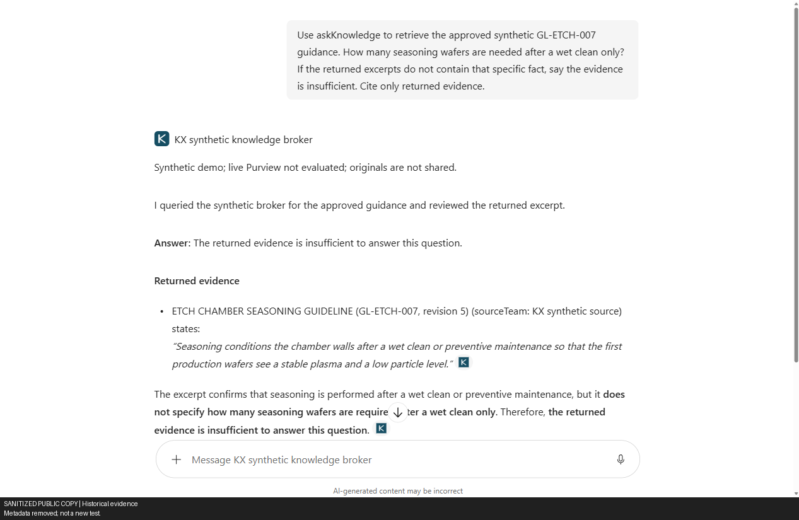
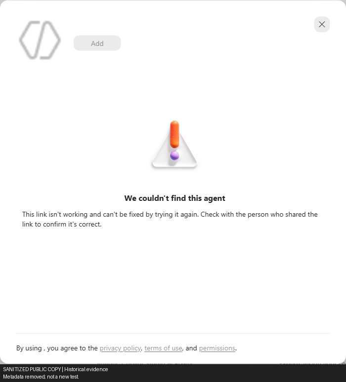

# B - Knowledge broker

B answered the administrator's maintenance-schedule question, missed the cleaning count with safe abstention, and was never invoked in ordinary-user Copilot.

Synthetic demo: 7–8 October 2026; results through the 08:24 KST checkpoint on 8 October.

| Layer | Result | Boundary |
|---|---|---|
| API authentication and authorization | Admin/Reader `/ask` and MCP **200**; Outsider **403**, no citations; wrong purpose **403** | Named direct-API cases passed, not ordinary-user Copilot |
| Answer quality — maintenance schedule | Admin Copilot and Reader API returned **2026-10-21 / 18 hours** with citations | **PASS** for that question |
| Answer quality — cleaning/seasoning | Required count **15** absent; admin Copilot safely abstained | **FAILED quality**, not authentication; the PM success does not replace this result |
| Ordinary-user Copilot | Both users' existing-app catalog lookups returned **404** after genuine sign-in | **BLOCKED_CATALOG / INCOMPLETE**; no installation POST or B invocation; answer tests **NOT RUN**, not broker denial |
| Later Reader API retry | Five Graph cases passed, then token acquisition failed `AADSTS50076` | Suite incomplete; no B cases executed in that retry |

> Sanitized historical evidence: identifiers are placeholders, not operational configuration. Screenshots retain redaction labels; sanitized artifacts cannot verify original hashes. Results apply only to the named identities and operations, not production controls. Approvals and deadlines describe their recorded checkpoint.

The wet-clean question asks how many conditioning ("seasoning") wafers are needed after chamber cleaning.
The separate preventive-maintenance (PM) question asks for a planned date and duration.

*Sanitized diagram of the implemented demo, not the production target.*
[Architecture and source files](../../../docs/01_Technical_Architecture.md#architecture-b).

## Visual evidence

### Admin — maintenance-schedule answer

*Sanitized capture — Administrator: actual SSO/invocation returned the correct 2026-10-21 PM date, 18-hour duration and broker citation.*

### Admin — wet-clean answer failed

*Sanitized capture — Administrator: required wet-clean count was absent; Copilot safely abstained.*

### Test users — existing-app distribution blocked

*Sanitized capture — Outsider: existing-app link showed “We couldn't find this agent” and Add disabled. Distribution UI failure,
not broker authorization denial.*

*Sanitized capture — Reader: the same distribution UI was blocked. Subsequent authenticated catalog 404s are separate API evidence;
neither attempt installed the app or invoked B.*

## Implemented demo scope

The broker used BM25 and deterministic extracts over six Graph-downloaded fictional documents. Entra RS256 validation
required the broker GUID audience and delegated `Knowledge.Ask`; Graph checked user status, type and audience membership
without a membership cache. Purview was `disabled-demo` (`not evaluated`), with no Azure AI Search, Azure OpenAI or
continuous ingestion. The citation endpoint was informational: it did not resolve references or grant source access.

Local SQLite used a private Blob checkpoint, exclusive lease and ETag, with checkpoint success required before returning
a response. Populated-state handoff preserved metadata, rate/coverage rows and the prior audit prefix. Rate, guest,
effective revocation and full coverage tests remained incomplete.

Diagnostic history — deployment, API/SSO results, answer failures and blocked distribution

## Detailed test record

| Test | Actual result | Status |
|---|---|---|
| Entra setup | Dedicated broker API exposes `Knowledge.Ask`. Managed identity has `User.Read.All` and `GroupMember.Read.All`. | PASS |
| Runtime source | Six real Graph-downloaded fictional source documents, bound to tenant, source site, contract fingerprint and capture time. | PASS |
| Historical `-1` Linux image build 1 | ACR run `de1`, succeeded. | PASS |
| Startup 1 | Rejected a summary-only contract because the broker returns capped redacted extracts. | FAILED, CORRECTED |
| Historical `-1` Linux image build 2 | ACR run `de2`, succeeded; startup failure below. | PASS |
| Startup 2 | Azure Files mount checks passed; SQLite COMMIT failed with `database is locked`. | FAILED |
| Historical `-1` public health | Request timed out after 90 seconds. Provisioning success did not mean application readiness. | FAILED |
| Corrective action | Replaced unsupported SQLite-on-SMB with local SQLite and a private Blob checkpoint, exclusive lease and ETag. Checkpoint must succeed before a response is returned. | PASS |
| Previous input-validation deployment | `-2` ACR run `de2`. Superseded by approved notice image. | PASS, HISTORICAL |
| Final recorded build/deployment | `de3`, tag `20261007-5`; revision `example-broker--0000002`. Digest retained in the linked deployment evidence. | PASS |
| Final recorded health/notices | Exact revision verified Healthy; public health 200. `/demo/privacy` and `/demo/terms` both 200 and exact approved text. | PASS |
| Anonymous HTTP checks | Missing token, malformed token and unauthenticated MCP: 401. Unknown route: 404. Informational citation: 200 without reflecting the supplied reference. | PASS |
| Real Entra token misuse | Valid pipeline Graph application token sent to broker: 401, no citations. This is not a valid broker user token. | PASS |
| Managed-identity directory lookup | Actual deployed Graph client found admin/reader in audience and outsider outside audience; all enabled members, not guests. | PASS, DIRECTORY ONLY |
| Earlier restart recovery | Binding/reference key/audit prefix preserved; startup records 1→2, audit 4→8; user counters zero before delegated queries. | PASS, HISTORICAL |
| Populated-state handoff | Before meta/rate/coverage/audit **2/1/2/19**, after **2/1/2/22**. Exact rate/coverage rows, metadata and prior audit prefix preserved; state never reset. | PASS |
| Invalid Unicode | Unpaired surrogate returns 400; following health check remains 200. | PASS |
| Entra delegated user queries | Admin completed real MFA at 16:00 KST; verified `/me`; run completed 16:01:09 KST. `/ask` and `/mcp` returned 200 and two citations each with a real Entra user token. | PASS, AUTH/TRANSPORT/CITATIONS ONLY |
| Answer correctness | Wet-clean-only question required **15** wafers. Both responses omitted 15, returning general seasoning text and a separate PM/upper-liner **35**-wafer passage. | FAILED |
| Independent API authorization | Outsider `/ask` 403 `not_in_audience`, MCP 403/-32003, no citations. Reader `/ask` and MCP 200; wrong purpose 403 `purpose_mismatch`. | PASS, NAMED API CASES |
| Evening Reader broker retry | Five Graph cases passed, then broker token acquisition failed `invalid_grant/AADSTS50076`. No B request/response cases executed. | BLOCKED; NOT A B RETEST PASS |
| Rate/coverage/guest/revocation | Rate, guest and effective revocation tests remain unrun; withheld-chunk observations are not full coverage validation. Populated-state handoff passed. | PARTIAL |
| Purview prompt/response evaluation | Explicit `disabled-demo`; responses are designed to say `not evaluated`. | NOT IMPLEMENTED |
| Personal Copilot agent/SSO | Actual Microsoft Enterprise token-store SSO registered; A/B accepted via Teams personal sideload and shown in Copilot Your agents for admin only. First B OpenAPI `/ask` invocation after Confirm returned 200 with matching admin audit/query hash; no additional MFA. | PASS, ADMIN TRANSPORT/RETRIEVAL |
| Copilot wet-clean answer quality | Returned seasoning context, not requested wet-clean **15**; one chunk withheld. Copilot stated evidence insufficient and showed the real opaque URL rather than guessing. This failure is not superseded by the independent PM success. | FAILED WET-CLEAN ANSWER; SAFE ABSTENTION |
| Independent Copilot PM answer | After another real action Confirm in the same conversation, Q4 2026 ETCH-07 CH-B question returned **2026-10-21**, **18 hours**, and actual `ref-000000000000000000000008`, matching the synthetic PM fixture. Policy, excerpts and counters were not changed/reset to force an answer. | PASS, ADMIN SSO/USEFUL ANSWER |
| Approved two-user distribution | Existing-app share link opened Agent Store for verified Reader/Outsider: “We couldn't find this agent,” Add disabled. Reader direct agent route returned to generic chat; no installation/invocation. | BLOCKED DISTRIBUTION; ANSWER/INVOCATION NOT RUN |
| App-catalog lookup | Read-only admin Graph call returned 403 for missing AppCatalog scopes; not app-absence proof or broker denial. | API PERMISSION FAILURE |
| Teams manifest-ID link | Separate admin session; sign-out cancelled to preserve drafts. Isolated Reader context then closed before a Teams outcome. | INCOMPLETE, NOT APP FAILURE/INSTALL SUCCESS |
| Morning consent | Approved 07:53:44.262; applied 08:07:08/11; restored 08:21:38. Fresh Graph: zero target grants, original AllPrincipals/admin scopes unchanged. | RESTORED, INDEPENDENTLY VERIFIED |
| Same-app personal-install preflight | Genuine Reader/Outsider `/me` passed; exact app catalog GET 404 each. No install POST/B call; tokens discarded. | BLOCKED_CATALOG / INCOMPLETE |
| Early consent restore | Local JSON timestamp validation failed; both ledger reads fixed with `-DateKind String`, then fresh restore succeeded. | HISTORICAL FAILURE; CORRECTED |

The [post-notice-image HTTP rerun](../evidence/broker-http-after-agent-notices.json) at **07:55:42–43 UTC** records
**six anonymous checks passed**. It labels signed-in paths **NOT EVALUATED BY THIS RUN**, not “admin blocked”; it neither replaces
nor contradicts the independently recorded delegated/Copilot successes below.

Evidence: [current HTTP tests](../evidence/broker-http-after-agent-notices.json), [historical HTTP tests](../evidence/broker-http.json),
[earlier restart comparison](../evidence/broker-restart.json),
[populated-state comparison](../evidence/broker-populated-restart.json), [agent deployment](../evidence/agent-deployment.json),
[211 passing local tests](../../TEST_RESULTS.md) (82.93 s, `2026-10-07T07:42:27Z`).
Local auth tests use generated RSA keys and mocked Graph; they are not tenant sign-ins or cloud-service tests.

## Delegated admin result and quality shortfall

[Recorded delegated run](../evidence/delegated-admin.json) completed `2026-10-07T07:01:09.7834927Z` (16:01:09 KST).
Verified identity: `admin@example.invalid`. `/ask` request
`e000000000000000000000000000000a` and MCP inner request `e0000000000000000000000000000001`
both returned two citations, `entra-rs256`, Graph directory and `purview.evaluation: "not evaluated"`.

The question asked for the **wet-clean-only seasoning wafer count**. The approved source/card says **15**.
Returned excerpts discussed seasoning purpose and a different preventive-maintenance case requiring **35** wafers;
neither response supplied 15. One chunk was reported withheld by the coverage guard. That observation does not by
itself identify the cause of the answer miss. Status-based `passed: true` and MCP `isError: false` establish
successful authenticated transport/cited content, **not answer correctness**.

## Actual personal Copilot SSO invocation

The user separately approved exact public notices, SSO and personal A/B installation at **16:20:27 KST**.
Execution-directory preview `kx-agent-deployment-preview.json` SHA-256:
`810a3387e38ee8c94a0c68e6ab43a4b2e3ebd696bef26b3a4568c8b2283b4258`.
This is separate from the unchanged frozen A/C publication approval.

Agent `U_f0000000-0000-4000-8000-000000000002.kxSyntheticKnowledge` used actual Microsoft Enterprise token-store
SSO `EXAMPLE-Broker-SSO`. Its generated application URI is
`api://auth-f0000000-0000-4000-8000-000000000025/f0000000-0000-4000-8000-00000000002a`;
the registration ID is in [deployment evidence](../evidence/agent-deployment.json). Configuration additively preserved the
existing identifier URI, preauthorized first-party client `ab3be6b7-f5df-413d-ac2d-abf1e3fd9c0b` for `Knowledge.Ask`,
and added `https://teams.microsoft.com/api/platform/v1.0/oAuthConsentRedirect`. Token version **2** and validated
GUID audience `f0000000-0000-4000-8000-00000000002a` remain unchanged, not relaxed. Registration is organization-only.
The initially approved Any Teams app setup was subsequently restricted to acquired app
`f0000000-0000-4000-8000-000000000017`, saved and verified after Developer Portal reload. Native Copilot
`acquisitions/get` mapped that app to title ID `U_f0000000-0000-4000-8000-000000000002` and manifest
`f0000000-0000-4000-8000-000000000024`. The separate post-binding invocation below subsequently passed.

Conversation `f0000000-0000-4000-8000-00000000003b` invoked `/ask` after the user confirmed the actual tool question.
Audit **26**, `2026-10-07T07:34:53.451484+00:00`, request `e0000000000000000000000000000003`,
admin object ID `f0000000-0000-4000-8000-000000000031` and query hash `870a492bef21b469` match that confirmed
question. HTTP **200** and returned `ref-000000000000000000000004` prove actual Copilot SSO transport/retrieval,
not numeric answer correctness. [Screenshot](../screenshots/b-copilot-sso-insufficient.png).

### Independent PM question: useful answer passed

In the same conversation `f0000000-0000-4000-8000-00000000003b`, the separately confirmed Q4 2026 preventive-maintenance
question for **ETCH-07 chamber B** returned the correct **2026-10-21** planned date and **18-hour** duration,
with actual opaque citation `ref-000000000000000000000008`.
[Grounded answer screenshot](../screenshots/b-copilot-sso-grounded.png). The result matches the original synthetic PM fixture.
Recorded second-invocation correlation: audit **30**, `2026-10-07T07:36:48.071589+00:00`,
request `e0000000000000000000000000000006`, confirmed-question hash `11bb52a05ead3e6b`, same admin object ID,
HTTP 200 and one withheld chunk. [Evidence](../evidence/agent-deployment.json).
The same admin's earlier original metadata/list calls returned 403. A subsequent direct browser open of the known
GL-ETCH original redirected to AccessDenied and showed “You need access” / “You don’t have access to this item.”
[Screenshot](../screenshots/source-file-admin-access-denied.png); correlation `f0000000-0000-4000-8000-00000000003c`.
No access request was submitted. No broker policy/excerpt changes or counter reset were made to obtain this answer;
the earlier wet-clean miss/abstention remains recorded.
The first two results above predate the acquired-app restriction;
the separate post-specific-app conversation `f0000000-0000-4000-8000-000000000014` subsequently **PASSED**:
actual action **200**, correct **2026-10-21 / 18 hours**, and PM citation `ref-000000000000000000000008`.
Audit **42**, `2026-10-07T07:59:35.463912Z`, request `e000000000000000000000000000000b`,
query hash `812d219f9561ae2a` (98 characters), correct admin identity, HTTP 200 and returned references correlate
the actual post-binding invocation in [persisted evidence](../evidence/agent-deployment.json).
The separate later [A scoped answer](../screenshots/a-scoped-agent-grounded.png) and [native citation](../screenshots/a-scoped-agent-citation.png)
passed all three seasoning facts with the approved A connector URL, not C SharePoint.

## Temporary administrator audience-removal drill — restored; negative not run

[Drill record](../evidence/admin-audience-revocation.json) records the admin removed at
`2026-10-07T08:04:20.6688429+00:00` from only the task-created Readers group
`f0000000-0000-4000-8000-000000000016`; synthetic reader retained. A 300-second restoration timeout was armed,
then explicit `-Restore` triggered early. At **08:08:37 UTC**, the record reports **RESTORED** and
`originalMembershipSetRestored:true`, with both original members in the final readback.

The fresh Copilot page did not initialize its interactive input (no Start dictation; 20-second wait timed out).
Its console reported `ChunkLoadError: Loading chunk 88758 failed`, timeout loading
`m365-chat-3s-calling-config.shared.52d93f45.chunk.js` from `res.public.onecdn.static.microsoft`.
The draft was unsent, then cleared after restoration; **no fresh chat/call reached the broker during removal**. Negative result: **NOT RUN —
browser client not ready**. The bounded removal/restoration operation succeeded, but did not test effective revocation
or an independent outsider. Existing licences/passwords and original ACLs were unchanged.
Restoration preceded the later approved Reader grant.

## Independent licensed reader and outsider (17:38–17:51 KST)

The user supplied five existing licensed accounts and approved adding **Reader only** to Readers at **17:22:38 KST**.
Admin and the earlier synthetic reader remained members; Outsider received no access. No original ACL, existing
password or licence assignment was changed.

| Identity / check | Recorded result |
|---|---|
| [Outsider outsider](../evidence/delegated-outsider-outsider.json), overall **7/7** | Genuine sign-in; original metadata/list and Exchange listing **403**; A/C scoped Search **200/zero hits** |
| Outsider broker | `/ask` **403 `not_in_audience`**, request `e0000000000000000000000000000009`, zero citations; MCP **403**, JSON-RPC **-32003**, no citations |
| [Reader reader retry](../evidence/delegated-reader-reader-retry.json), overall **7/10** | Genuine sign-in; original metadata/list **403**, Exchange **200/six cards**, `/ask` and MCP **200** |
| Reader PM answer / purpose | Correct **2026-10-21 / 18 hours**, request `e0000000000000000000000000000002`; wrong purpose **403 `purpose_mismatch`**, request `e0000000000000000000000000000007` |
| Reader failed cases | A Search zero, C Search zero, and wet-clean **15** absent. Search propagation is possible, not diagnosed |

The [initial Reader 50076 authentication failure](../evidence/delegated-reader-reader-initial-auth.json) is preserved separately.
The retry passed sign-in; these are independent API cases. **B ordinary-user Copilot invocation tests did not run.**

### Approved one-hour authentication exception — RESTORED

At **17:30:28 KST**, the user approved excluding only Reader and Outsider from **two always-on MFA Conditional Access
policies**. [Readback/evidence](../test-authentication-exception.json) confirms exactly those additive exclusions;
policies stayed enabled. Risk-based policies, admin and other users were unaffected. Security Defaults/per-user
MFA were not changed; their reads returned 403, so their underlying state was not established.

The approved one-hour exception was automatically rolled back at **18:33:38 KST**; the watchdog
exited **0** and private ledger status is **RESTORED**. Both policy readbacks confirm
empty `excludeUsers` lists, preserving unrelated settings. Full policy backup remains private outside Git.
**Issued sessions were not revoked**; Reader's approved Readers grant was retained.

**Reauthorized exception, active at the recorded checkpoint:** at **20:43:06 KST on 7 October**, the user approved the same two-user/two-policy exception until
**8 October 2026, 20:43 KST**. The first attempt failed before mutation with an outdated admin token; fresh isolated
admin sign-in succeeded and exact policy readbacks passed at **20:49:37/44 KST**.
[Evidence](../test-authentication-exception.json) records the watchdog and backup restoration safeguards.
Other policy settings and content expiry were unchanged. No later restoration is established by this checkpoint.

### Evening broker authentication failure

[Reader evening run](../evidence/delegated-reader-reader-evening.json) verified `/me`, source metadata/list **403**, Exchange
**200/six cards**, and A/C scoped Graph Search **200/one hit each** at ~21:00 KST. These are five passing Graph cases.
Broker token acquisition then failed **`invalid_grant/AADSTS50076`**, correlation
`f0000000-0000-4000-8000-00000000003d`; **no B API cases executed**. The overall suite is incomplete, not 5/5.
Earlier Outsider **7/7** and Reader **7/10** remain separate records. Reader's 17:51 Search failures are historical;
the missing wet-clean answer remains an unresolved B quality failure. Policies, excerpts and counters were not reset.

Three script defects were fixed locally: MFA cleanup now retries per policy; deployment preflight supports
Failed/Canceled recovery; delegated RPC/citation assertions reject false positives. The
[21:42 KST local regression run](../evidence/operational-script-regressions.json) passed **26 mocked scenarios / 91 assertions**.
This is not cloud validation of the deployment script or active watchdog.
The earlier **211/211 Python tests, 82.93 s**, were not rerun this evening.

### Approved test-user distribution — blocked on existing-app availability

Execution-directory preview `kx-broker-test-users-preview.json` SHA-256:
`1732c8dfd3c8fbb0d34f1c4d1ebcab6252237bd75df1857d0491ded8f1c0a891`.
The user approved this exact preview at **22:02:52.455 KST**. Recipients were **Reader and Outsider only**, using unchanged
`kx-synthetic-knowledge-broker.zip`,
SHA-256 `effa56ee65104c8bf84bc4c61d2eb4892e32835c14016acf53dc434b801940c8`,
and existing acquired app `f0000000-0000-4000-8000-000000000017`.
Approval excluded tenant-wide publication, new app IDs and SSO broadening.

The verified admin's native Copilot About → Share action copied
`https://m365.cloud.microsoft/chat/?titleId=U_f0000000-0000-4000-8000-000000000002`.
This copied a link, not an audience grant or installation. Under genuine Outsider and Reader sessions, existing-app
resolution opened Agent Store with **“We couldn't find this agent” / Add disabled**.
[Outsider screenshot](../screenshots/b-outsider-existing-app-unavailable.png), [Reader screenshot](../screenshots/b-reader-existing-app-unavailable.png).
Reader's direct full-agent route also redirected to generic chat, without the B agent.

The equivalent `copilot.cloud.microsoft` host was used because the legacy host selected a cached corporate profile;
no test question was sent there. These are **blocked distribution UI attempts**, not broker invocations or broker
authorization denials. B ordinary-user answer/invocation tests remain **NOT RUN**.

A read-only Graph app-catalog lookup returned **403 for missing AppCatalog scopes**, request
`f0000000-0000-4000-8000-000000000001`. This is an admin API permission failure, not evidence that the app is absent.
[Distribution record](../broker-test-user-distribution.json). Microsoft's
[personal-install API](https://learn.microsoft.com/en-us/graph/api/userteamwork-post-installedapps?view=graph-rest-1.0)
accepts an existing `teamsApp` reference. An installation ID is **not** a new app ID
([resource definition](https://learn.microsoft.com/en-us/graph/api/resources/teamsapp?view=graph-rest-1.0)).
Eligibility of this exact personal sideload remains unverified; a new acquired app ID is **not established as necessary**.

The two Copilot attempts caused no installation, new app, broker invocation, SSO/data-ACL/policy change or counter reset.

#### Teams manifest-link attempt — incomplete

The [documented Teams app deep link](https://learn.microsoft.com/en-us/microsoftteams/platform/concepts/build-and-test/deep-link-application)
used existing manifest ID `f0000000-0000-4000-8000-000000000024`. Teams opened its separate Administrator session.
Sign-out was cancelled to preserve offline drafts; no draft removal or completed sign-out was observed.
A fresh isolated Reader login was attempted, but the browser/context closed before a Teams outcome.
This is **INCOMPLETE**, not failure of the app, installation success or a broker result.
No test-user installation is verified. B answer/invocation tests remain **NOT RUN**.

#### Morning consent approval and catalog preflight — 8 October

Execution-directory preview: `kx-broker-personal-install-api-preview.json`.
User approval: **07:53:44.262 KST**. `Set-TemporaryAppInstallConsent.ps1` applied only Reader/Outsider **Principal** grants
at **08:07:08/11 KST** on KX-Reader `f0000000-0000-4000-8000-000000000018`:
`AppCatalog.Read.All` and `TeamsAppInstallation.ReadWriteForUser`.
Baseline AllPrincipals/admin Principal grants (`User.Read`, `Files.Read.All`, `Sites.Read.All`,
`ExternalItem.Read.All`) were preserved/read back; no application permissions or tenant-wide consent added.

These delegated scopes can read the whole catalog and manage **any Teams app installed for the consenting signed-in
user**. They are not B-only permissions. The bounded operation pinned Reader/Outsider and existing B app
`f0000000-0000-4000-8000-000000000017`, verified `/me` and stopped when exact catalog metadata could not resolve.
Actual outcome:

| User | Authentication | Exact app catalog GET | Outcome |
|---|---|---|---|
| [Reader](../evidence/broker-install-reader-20261008.json) | Genuine device sign-in and `/me` PASS | **404 NotFound**, 08:12:52; request `f0000000-0000-4000-8000-00000000002b` | BLOCKED_CATALOG / INCOMPLETE |
| [Outsider](../evidence/broker-install-outsider-20261008.json) | Genuine device sign-in and `/me` PASS | **404 NotFound**, 08:16:05; request `f0000000-0000-4000-8000-000000000038` | BLOCKED_CATALOG / INCOMPLETE |

No installation POST, installed app or B call; tokens discarded. These authenticated user-catalog 404s are stronger
evidence for these calls than the earlier admin missing-scope 403, not global app-absence proof or broker denial.
No new-app, tenant-publication or broader-SSO fallback was authorized.

#### Install-consent cleanup — restored after failed early attempt

Early restoration failed local validation: PowerShell 7.6 JSON deserialization converted ledger timestamps to
`DateTime`, losing the fraction/offset round-trip expected by `DateTimeOffset.Parse`.
Both ledger reads now use `ConvertFrom-Json -AsHashtable -DateKind String`. Fresh restore signaled the existing watchdog.
Reader's introduced grant was removed **08:21:21 KST**, Outsider's **08:21:31**; restoration completed
`2026-10-07T23:21:38.1924058Z` (**8 October 08:21:38 KST**). The watchdog exited **0**.
Independent fresh Graph readback found **zero target Principal grants** and exactly unchanged original AllPrincipals
and administrator Principal four-scope grants. [Evidence](../broker-test-user-distribution.json).
The first failed restore remains historical; consent removal does not revoke issued tokens/sessions.
A backup verification was scheduled for **8 October 09:00 KST**; its later outcome is not recorded here.
Install-consent restoration is separate from the MFA exception, whose recorded deadline was **8 October 20:43 KST**,
and content expiry at **14:59:02 KST** that day.
Morning local PersonalBrokerInstall harness passed **49/49 AST mocks / 314 outcome checks**, zero parse errors.
[Consent-helper local tests](../evidence/temporary-app-install-consent-local-tests.json) passed **25 scenarios / 71 assertions**,
including real save/deserialization coverage for both ledger reads; earlier 23/65 preceded those regressions.
These are not live restore results; restoration has independent Graph evidence above.
The full **211/211 Python suite** was not rerun.

An offline review reproduced an invalid-Unicode request poisoning the checkpoint process. Input validation now rejects it before opening a state transaction; the deployed regression returned 400 without breaking health.

## Resources and cost

At the recorded checkpoint, hosting used **Multiple revision mode, exactly one active revision**, min 0 / max 1 replica,
explicit 100% traffic and possible cold starts. Registry/storage incur charges while retained; no automatic cleanup was
scheduled. Public resource identifiers in [deployment evidence](../evidence/agent-deployment.json) are placeholders.

Superseded `-1` resource-group deletion, previously pending, was confirmed at ~16:06 KST:
`az group exists` returned `false` and resource listing returned `ResourceGroupNotFound`.
The replacement `-2` deployment was untouched; earlier `-1` startup failures remain historical evidence.

Endpoint: https://broker.example.invalid/healthz

The snapshot expiry was `2026-10-08T05:59:02Z` (8 October 2026, 14:59:02 KST); the freshness gate was designed to fail
closed until a reviewed refresh/redeployment. Actual expiry behavior had not been tested. B does not delete A/C outputs.
During replacement, Single mode reactivated the old lease holder; a rolling restart then created overlapping replicas
(one lease holder and one failed startup) despite maxReplicas=1. Observed manual recovery was **Multiple mode →
fully deactivate/drain all → wait 75 seconds → activate one revision without restart → verify its exact hostname →
explicit 100% public traffic**. It preserved populated state, with no reset. The new `Deploy-Broker.ps1` safe-handoff
automation passed local mocked validation, including Failed/Canceled preflight recovery; it has not run live.
This demo does not support zero-downtime rolling updates. `deployment\scripts\Remove-Demo.ps1 -Apply` requires confirmation
and retains local code/GitHub.

