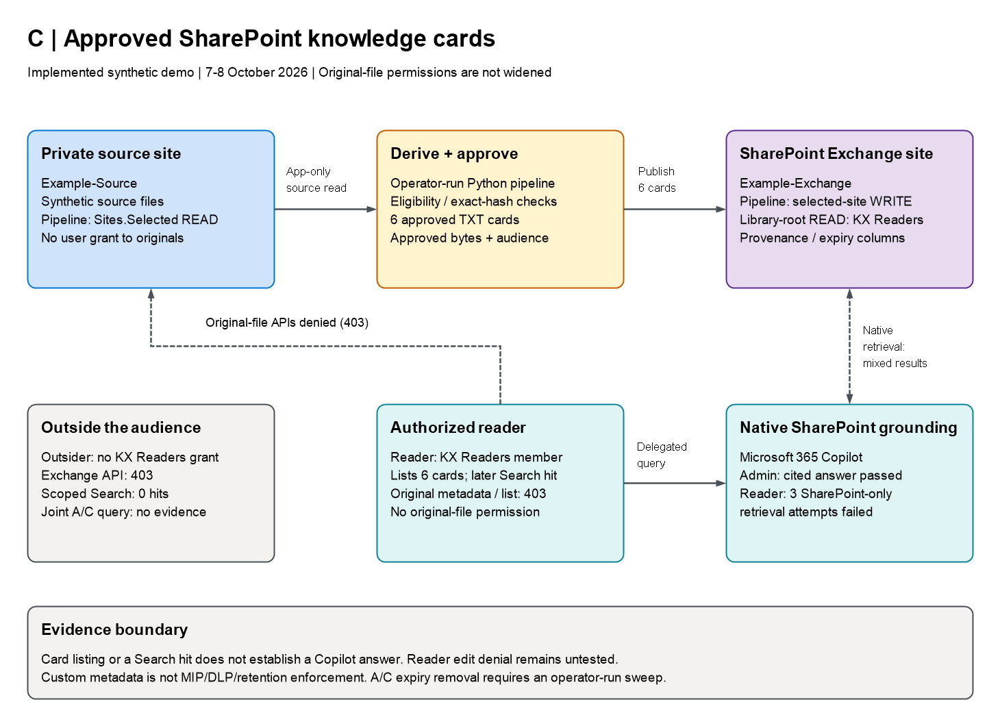
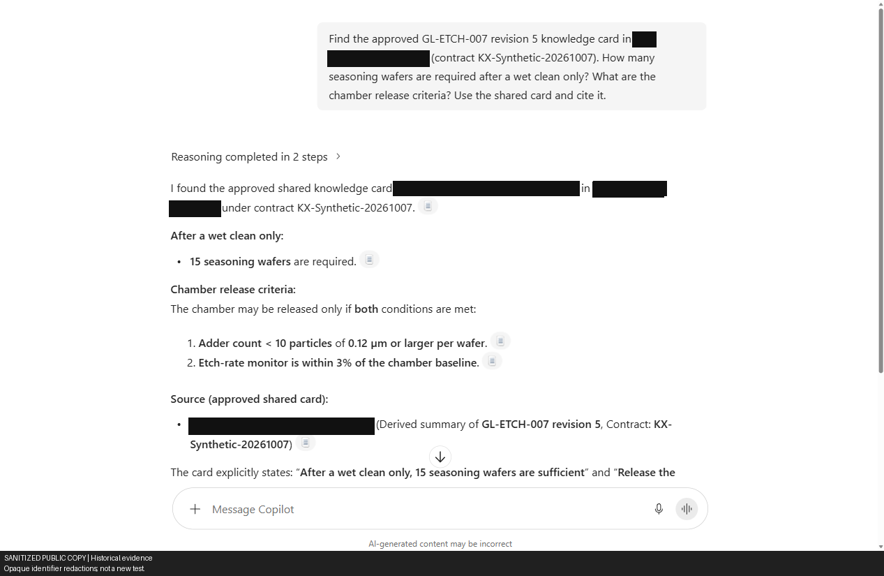
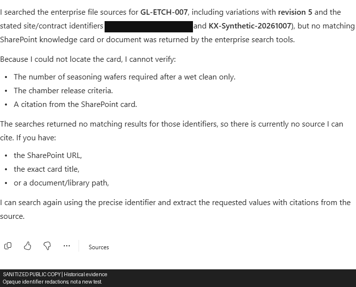
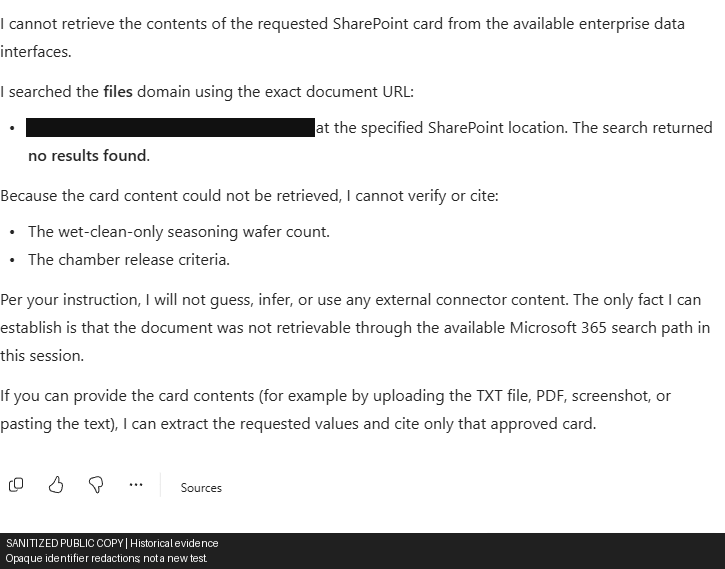
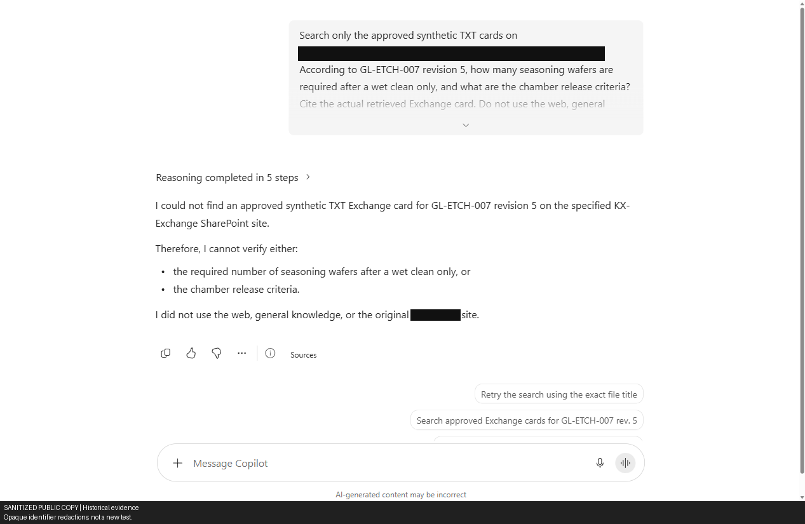

# C - Governed derivative publishing

C produced an accurate cited answer for the administrator, but all three ordinary-Reader C-only Copilot attempts failed despite successful listing and later scoped Search.

Synthetic demo: 7–8 October 2026; results through the 08:24 KST checkpoint on 8 October.

| Test | Result | Boundary |
|---|---|---|
| Publication | Six approved TXT cards matched downloaded bytes and metadata | Synthetic output approval, not a customer governance workflow |
| Administrator Copilot | **PASS:** requested cleaning/seasoning facts and actual Exchange citation | Earlier no-result and generic-error attempts retained below |
| Ordinary Reader API | Exchange listing **200/six cards**; later C-scoped Search **200/one hit** | Earlier zero-hit positive test failed; edit denial **NOT RUN** |
| Ordinary Reader Copilot | Named-card, viewer-URL and direct-TXT-URL attempts: **three failed positive retrievals**, safe abstention | Mixed-source answer cited A and failed C source isolation |
| Outsider | Exchange **403** and C-scoped Search zero hits; joint A/C Copilot prompt returned no facts/citations | Separate scoped API negative; **one** joint UI scenario |
| Lifecycle and controls | Withdrawal/re-publication passed; actual expiry, guest and revocation tests **NOT RUN** | MIP/retention, DLP and block-download **NOT CONFIGURED** |

> Sanitized historical evidence: identifiers are placeholders, not operational configuration. Screenshots retain redaction labels; sanitized artifacts cannot verify original hashes. Results apply only to the named identities and operations, not production controls. Approvals and deadlines describe their recorded checkpoint.

*Sanitized diagram of the implemented demo, not the production target.*
[Architecture and source files](../../../docs/01_Technical_Architecture.md#architecture-c).

## Visual evidence

### Admin — C grounding passed

*Sanitized capture — Administrator: named-card query returned the requested seasoning facts and an actual Exchange citation.
This does not establish ordinary-reader retrieval.*

### Ordinary reader — C-only retrieval failed

*Sanitized capture — Reader: Microsoft 365 data on, KX connector off; no card or citation. Failed positive retrieval with safe abstention.*

*Sanitized capture — Reader: final direct-TXT-URL retry also failed with no citation. Named-card, viewer-URL and direct-URL attempts all failed;
the separate Graph Search hit does not pass Copilot retrieval.*

Diagnostic history — earlier admin retrieval failure

*Sanitized capture — Administrator: initial C-scoped query found no approved card or citation.*

## Approval and lifecycle boundary

[Publication preview](../PUBLICATION_PREVIEW.md) contains sanitized copies of the reviewed JSON/TXT payloads, not
the original bytes. In the demo, publication checked approved bytes and source fingerprints; re-publication retained
identical content and the original expiry.

The manual cleanup deadline was `2026-10-08T05:59:02Z` (**8 October, 14:59:02 KST**). Expiry metadata does not delete
cards: ingestion, reconciliation and `live_poc sweep` were operator-run. B's snapshot expiry does not delete C cards,
and copies, retained versions and conversation history cannot be recalled. Library-root `read` does not establish
effective edit denial or download prevention.

Diagnostic history — publication checks, retrieval failures and identity-specific retries

## Detailed test record

| Test | Actual result | Status |
|---|---|---|
| Site isolation | Separate private source and Exchange sites created. Source group excludes reader, outsider and administrator; group membership alone is not proof of file denial. | PASS, LIMITED SCOPE |
| Publisher permissions | Pipeline granted read on source and write on Exchange via `Sites.Selected`. | PASS |
| Audience read grant | Readers has Exchange library-root `read`; earlier synthetic reader's edit-group grant removed. Later Reader listing passed; effective edit denial remains untested. | PASS READBACK/LISTING; EDIT DENIAL NOT RUN |
| Provenance columns | Custom contract, source fingerprint, approval, output hash, expiry and classification-authority columns created. | PASS |
| Source eligibility | Six real files passed hash/path/opt-in checks; four excluded. | PASS |
| Card generation | Six frozen TXT cards with source fingerprints, opaque citations and one-day expiry metadata. | PASS |
| Known-pattern leak scan | All twelve prepared A/C payloads passed seeded PII/secret and highly-confidential canary scans; no original SharePoint host in outputs. | PASS, PAYLOAD SCAN ONLY |
| Approval | User approved the exact twelve A/C outputs at 15:02 KST; approved hashes verified before writes. | PASS |
| SharePoint publication | Six TXT cards uploaded; downloaded bytes and custom metadata matched approved values. | PASS |
| Independent reader/outsider API access | Reader: source metadata/list 403, Exchange 200/six cards; Outsider: source metadata/list and Exchange 403. No passwords/licences reassigned. | PASS, NAMED API CASES |
| Independent C Search | Reader 200/zero at 17:51 (failed positive), then 200/one hit at ~21:00; Outsider 200/zero as expected. Earlier failure cause unknown. | EVENING READER PASS; OUTSIDER NEGATIVE PASS |
| Reader mixed-source Copilot | Correct seasoning facts, but actual native citation/click used A connector URL. | FAILED C SOURCE ISOLATION; A POSITIVE |
| Reader C-only Copilot | Fresh conversation: Microsoft 365 data on, KX connector off. Named-card, exact-viewer-URL and direct-TXT-URL retries returned no results/no citations with safe abstention. | THREE FAILED POSITIVE RETRIEVALS |
| Outsider native A/C negative | Verified Outsider account, both sources on: joint A/C prompt returned no accessible evidence, requested facts or citations. | PASS, ONE OBSERVED OUTSIDER SCENARIO |
| Reader edit denial | Read/list access does not establish inability to edit. | NOT RUN |
| Native Copilot browser sign-in | ~15:51 KST: existing session switched to `admin@example.invalid`; actual account menu email/tenant verified, without new MFA. | PASS, SIGN-IN ONLY |
| Initial native Copilot grounding | First C-scoped question found no approved TXT Exchange card/citation; exact-card-URL retry later returned a generic response failure. Neither result establishes the cause. | FAILED, HISTORICAL ATTEMPTS |
| Named-card native Copilot grounding | Same verified admin received **15 wafers**, **<10 particles ≥0.12 µm per wafer**, **etch rate within 3% of baseline**, with the actual Exchange viewer citation. Same admin's original metadata/list calls returned 403. | PASS, ADMIN POSITIVE PATH |
| Actual original-file browser open | Same admin directly opened the known GL-ETCH original: redirected to AccessDenied; UI “You need access” / “You don’t have access to this item.” No access request submitted. | PASS, ADMIN ORIGINAL-OPEN NEGATIVE |
| Withdrawal/re-publication | One source's A/C outputs deleted; GET returned 404. Repeat deletion changed nothing. Byte-identical re-publication restored six cards. | PASS |
| Reconciliation/pre-expiry sweep | Unchanged sources produced zero deletions; all twelve A/C ledger entries committed. | PASS |
| Actual expiry removal | Deadline 8 October 2026, 14:59:02 KST; not tested before that deadline. | NOT RUN |
| MIP sensitivity/retention, DLP, block-download | Custom columns do not provide these controls. | NOT CONFIGURED |

## Cross-source observation and completed C retries

The corrected A-intended prompt returned correct seasoning facts but cited this C SharePoint viewer:
`https://sharepoint.example.invalid/sites/Example-Exchange/_layouts/15/viewer.aspx?sourcedoc={f0000000-0000-4000-8000-000000000009}`.
Conversation `f0000000-0000-4000-8000-000000000012`; [screenshot](../screenshots/a-copilot-cross-source-citation.png).
This is observed C-sourced content in a mixed-source attempt, not an isolated A pass. The explicit card-URL retry
(`f0000000-0000-4000-8000-000000000033`) returned a generic response failure. The later C named-card query,
conversation `f0000000-0000-4000-8000-000000000022`, independently returned all three requested facts and the
actual Exchange citation above. [Successful screenshot](../screenshots/c-copilot-admin-grounded.png);
[complete attempt history](../evidence/copilot-admin-continuation.json). Earlier failures remain historical, not relabelled passes.

## Initial native Copilot attempt (retained history)

Conversation: `f0000000-0000-4000-8000-00000000003a`, verified account `admin@example.invalid`.
[Screenshot](../screenshots/c-copilot-admin-not-found.png).
The question restricted grounding to `Example-Exchange` and asked for GL-ETCH-007 revision 5's wet-clean wafer
count and release criteria, without embedding those answers. Copilot replied:

> “I could not find an approved synthetic TXT Exchange card ... Therefore, I cannot verify either...”

No card citation was returned. This is a **failed positive retrieval attempt**, not an MFA block or a passed
negative-access test. The result alone does not establish whether indexing, discoverability, permissions or another
factor caused it. Later named-card success establishes that admin positive path only; it does not diagnose the first
failure or establish ordinary-reader/outsider enforcement.

**Delegated run completed 16:01:09 KST:** after real admin MFA at 16:00, `/me` matched admin, source metadata/list
calls returned `403`, Exchange listing returned `200` with all six cards, and Exchange-scoped `/search/query`
returned `200` with one hit. [Recorded evidence](../evidence/delegated-admin.json); C Search request
`f0000000-0000-4000-8000-000000000003`. This API hit does not convert the earlier Copilot failure into a pass or
establish its root cause. Later independent API/UI results below are separate; effective read-only access remains unverified.
The same admin's later direct original-file browser denial is also recorded:
[screenshot](../screenshots/source-file-admin-access-denied.png), correlation `f0000000-0000-4000-8000-00000000003c`.
The later [A scoped answer](../screenshots/a-scoped-agent-grounded.png) used an actual clicked native connector citation
([panel](../screenshots/a-scoped-agent-citation.png)) matching the approved A opaque URL, **not this C SharePoint card**.
The later temporary admin-removal drill restored the exact original membership. Its broker negative was **NOT RUN**
because Copilot's client chunk failed to load; it is not an independent-user or C access-control pass.
[Record](../evidence/admin-audience-revocation.json). Subsequent independent API results are not a rerun of that failed browser attempt.

## Independent licensed users and temporary authentication exception

Following user approval at **17:22:38 KST**, only Reader was added to Readers; admin/original synthetic reader retained,
Outsider not granted access. Original ACLs/passwords/licences were unchanged.
[Reader's genuine reader sign-in/retry](../evidence/delegated-reader-reader-retry.json), completed **17:51:55 KST**, returned original
metadata/list **403** and Exchange **200/six cards**, but C scoped Search **200/zero**:
request `f0000000-0000-4000-8000-000000000013`, **failed positive retrieval**.
[Outsider outsider](../evidence/delegated-outsider-outsider.json), completed **17:39:09 KST**, returned original/Exchange **403**
and C Search **200/zero**, request `f0000000-0000-4000-8000-00000000000f`, **passed scoped negative**.

Reader's 17:51 run was **7/10** (A/C Search and B wet-clean quality failed), Outsider **7/7**. The initial
[Reader 50076 failure](../evidence/delegated-reader-reader-initial-auth.json) remains historical.
Group/search propagation is a hypothesis, not a proven explanation.

The **17:30:28 KST** approved one-hour [MFA exception](../test-authentication-exception.json) excluded only Reader/Outsider
from two policies, not the tenant/admin; risk policies, other users and Security Defaults/per-user MFA were unchanged.
Automatic rollback completed **18:33:38 KST**: both `excludeUsers` lists empty, private ledger RESTORED, watchdog
exited **0**. Full backup remains private outside Git. Issued sessions were **not revoked**; future sign-ins may
require MFA. Reader's approved Readers grant remains.

At the recorded checkpoint, the same two-user/two-policy MFA exception had been reauthorized through
**8 October 2026, 20:43 KST**. An outdated-admin-token attempt failed before mutation; fresh isolated admin
sign-in and policy readbacks then succeeded. [Authentication history](../test-authentication-exception.json)
records the restoration safeguards, not a later restoration result. Content expiry was unchanged.

## Evening Reader API and actual Copilot attempts

[Reader evening API evidence](../evidence/delegated-reader-reader-evening.json) verifies object
`f0000000-0000-4000-8000-00000000001a`, original metadata/list **403**, Exchange **200/six cards**,
and A/C Search **200/one hit each**. C request: `f0000000-0000-4000-8000-00000000001f`.
Five Graph cases passed; broker-token acquisition then failed **`invalid_grant/AADSTS50076`** before any B cases.
The suite is incomplete, not an overall 5/5. Earlier zero-hit failures remain history; their cause is not established.

Closing only the managed browser and signing in again recovered Copilot at ~21:19 KST; account menu confirmed
Reader's exact UPN and tenant. Mixed-source conversation `f0000000-0000-4000-8000-00000000000e` used a C-named-card
prompt and returned correct **15 / <10 particles ≥0.12 µm / within 3%** facts. Native citation metadata and the actual
click opened approved **A** `access-request?ref=ref-000000000000000000000005`. This is an A ordinary-reader positive,
**not C grounding**. Reader had no personally installed A agent.

Fresh conversation `f0000000-0000-4000-8000-000000000011` selected **Microsoft 365 data on / KX synthetic derived
knowledge off**. The C named-card prompt, exact-viewer-URL retry and direct-TXT-URL retry (~21:32) each returned
**no results/no citations**, with safe abstention. These are three failed C positive-retrieval attempts, not access-denial passes.
[Named-card screenshot](../screenshots/c-copilot-reader-no-results.png), [direct-URL screenshot](../screenshots/c-copilot-reader-direct-url-failed.png);
[selected-user record](../evidence/copilot-selected-users.json).

The separate SharePoint browser session still belonged to admin despite Reader's verified Copilot session.
Its direct-original attempt is **not credited to Reader**; only Reader's verified delegated API 403s establish that negative.

## Outsider native Copilot outsider check

Account-menu UPN `Outsider@example.invalid` and expected tenant verified at ~21:34 KST.
Conversation `f0000000-0000-4000-8000-000000000010` (~21:36) selected **Microsoft 365 data on / KX connector on**
and asked for the same facts from either approved source. Copilot reported no accessible evidence and returned
**no requested facts and zero citations**, with safe abstention.
**PASS for one joint A/C outsider scenario**, not separate internal retrieval traces or a general isolation guarantee.
[Screenshot](../screenshots/ac-copilot-outsider-no-evidence.png); [record](../evidence/copilot-selected-users.json).
The separate B [distribution record](../broker-test-user-distribution.json) retains unavailable-agent/Add-disabled
failures and an incomplete Teams attempt. With approved temporary catalog/install scopes on 8 October,
genuine sign-in/`/me` passed, but exact B catalog GET returned 404 for
[Reader](../evidence/broker-install-reader-20261008.json) and [Outsider](../evidence/broker-install-outsider-20261008.json):
**BLOCKED_CATALOG/INCOMPLETE**, no installation POST/B call; tokens discarded. Not global app-absence proof or broker denial.
Early consent restore failed local timestamp validation. Fixing both ledger reads with `-DateKind String` enabled
fresh restore: **RESTORED at 08:21:38 KST**. Independent Graph readback
found **zero target Principal grants** and unchanged baseline AllPrincipals/admin scopes.
Install-consent restoration is separate from the MFA deadline (**8 October 20:43 KST**) and content expiry
(**14:59:02 KST** that day). None of these B distribution checks changes C's three failed positive retrievals.

A code review found that a recreated card with a lost upload response could leave cleanup using an old item ID. Pending writes now start without an inherited remote ID; cleanup uses the stable filename until the new ID is confirmed. A regression covers this case; the live drill did not inject a network failure.

Evidence: [live lifecycle results](../evidence/ac-lifecycle.json), [admin Copilot continuation](../evidence/copilot-admin-continuation.json),
[211 passing local tests](../../TEST_RESULTS.md) (82.93 s, `2026-10-07T07:42:27Z`; not cloud-service tests).
That full suite was not rerun this evening. The [21:42 KST local regression run](../evidence/operational-script-regressions.json)
passed 26 mocked scenarios / 91 assertions; it does not validate cloud deployment or the active watchdog.
Morning PersonalBrokerInstall: **49/49 AST mocks / 314 checks**, zero parse errors;
[consent helper](../evidence/temporary-app-install-consent-local-tests.json) **25 scenarios / 71 assertions**.
Live consent restoration has separate Graph evidence; full Python suite not rerun.
Original simulation results remain separate in `../offline-baseline/`.

